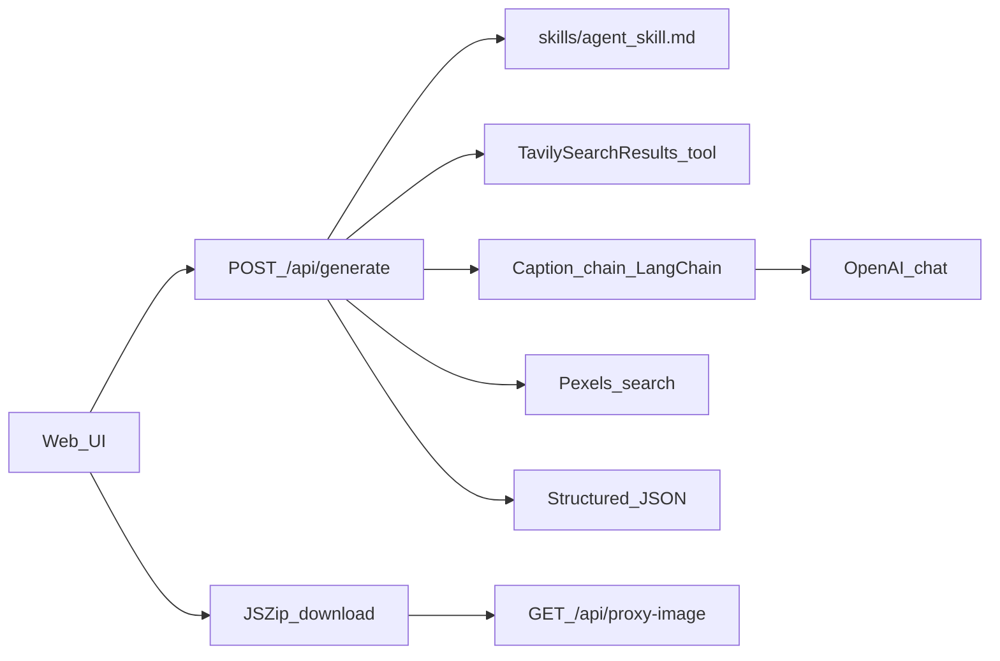

# AI Social Media Brand Agent

A **production-style** demo that turns a short **product description** into an **Instagram-ready bundle**: trend-grounded copy (hook / value / CTA), hashtags, creative direction, and a **Pexels** stock image—served through a **Next.js** web UI with a **ZIP download** (“post pack”).

## Stack

- **Next.js 15** (App Router, TypeScript)
- **LangChain** (`@langchain/core`, `@langchain/openai`, `@langchain/community`)
- **OpenAI** (chat model for structured JSON creative)
- **Tavily** (search tool for trend / marketing signals)
- **Pexels** (stock photography)
- **Zod** + **`JsonMarkdownStructuredOutputParser`** for structured LLM output
- **JSZip** (client-side “Download post pack”)

## How it works



1. **`skills/agent_skill.md`** — persona and rules (loaded server-side into the LLM system context).
2. **`TavilySearchResults`** — LangChain tool hits Tavily; results are normalized into a research brief.
3. **Caption chain** — `ChatOpenAI` + `ChatPromptTemplate` + **`JsonMarkdownStructuredOutputParser`** → Zod-validated fields (including `researchSummary`, hook/value/CTA, hashtags, `pexelsSearchQuery`).
4. **Pexels** — server searches photos; best portrait/square URL is returned with photographer credit.
5. **UI** — displays JSON sections; **Download post pack** builds `caption.txt` + `image.jpg` (image bytes via **`/api/proxy-image`** to avoid browser CORS issues).

## Local setup

```bash
npm install
cp .env.example .env.local
# fill OPENAI_API_KEY, TAVILY_API_KEY, PEXELS_API_KEY
npm run dev
```

Open [http://localhost:3000](http://localhost:3000).

### Environment variables

| Variable | Purpose |
|----------|---------|
| `OPENAI_API_KEY` | OpenAI API key for `gpt-4o-mini` |
| `TAVILY_API_KEY` | Tavily Search API key |
| `PEXELS_API_KEY` | Pexels API key |

See [`.env.example`](.env.example).

## API

### `POST /api/generate`

JSON body:

```json
{
  "productDescription": "Luxury protein coffee for gym professionals",
  "title": "Optional short title"
}
```

Response: structured JSON (`researchSummary`, `caption`, `hashtags`, `creativeDirection`, `image`, `tavilyQuery`, `pexelsQuery`).

### `GET /api/proxy-image?url=...`

Streams an image from **`images.pexels.com` only** (used for ZIP download).

## Deploy on Vercel

1. Push this repository to GitHub.
2. In [Vercel](https://vercel.com), **Import** the repo as a **Next.js** project.
3. Add the same environment variables in **Project → Settings → Environment Variables**.
4. Deploy. Increase **function max duration** if needed (Project → Functions); generation runs Tavily + OpenAI + Pexels sequentially.

Ensure `skills/agent_skill.md` stays in the repo so production can read it from `process.cwd()`.

## Scripts

| Command | Description |
|---------|-------------|
| `npm run dev` | Local dev server |
| `npm run build` | Production build |
| `npm run start` | Start production server |
| `npm run lint` | ESLint |

## Project layout

- [`skills/agent_skill.md`](skills/agent_skill.md) — agent “brain” instructions  
- [`lib/tools/tavilyTrends.ts`](lib/tools/tavilyTrends.ts) — Tavily LangChain tool + brief normalization  
- [`lib/chains/caption.ts`](lib/chains/caption.ts) — caption / hashtags / creative JSON chain  
- [`lib/clients/pexels.ts`](lib/clients/pexels.ts) — Pexels search + pick  
- [`lib/schema/postOutput.ts`](lib/schema/postOutput.ts) — Zod schemas  
- [`lib/agent/orchestrator.ts`](lib/agent/orchestrator.ts) — pipeline wiring  
- [`app/api/generate/route.ts`](app/api/generate/route.ts) — HTTP entry  
- [`app/page.tsx`](app/page.tsx) — UI + ZIP download  

## Credits

- Photos provided by [Pexels](https://www.pexels.com/) (attribution surfaced in the UI and in `caption.txt`).
